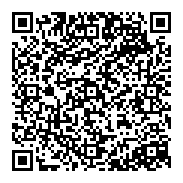

Shelter (krab fork)
===

Shelter is a Free and Open-Source (FOSS) app that leverages the "Work Profile" feature of Android to provide an isolated space that you can install or clone apps into.

This is a fork of [PeterCxy/Shelter](https://gitea.angry.im/PeterCxy/Shelter), maintained for use on a BlackBerry KEY2. It follows upstream and adds the fixes and changes listed below. Everything else in this README describes upstream Shelter and applies here too.

Differences from upstream
===

Based on upstream `master` (post-1.9.1), including its SDK 35 update, the edge-to-edge work, monochrome launcher icons and translation cleanups.

Fixes
---

- **Work profile setup on ROMs without a device policy role holder.** Android 14+ routes provisioning through the Device Policy Management role holder. On a ROM that declares the role but ships no holder, `managedprovisioning` refuses before it starts and the wizard could only show a bare "Setup failed". Passing `PROVISIONING_ALLOW_OFFLINE` makes the platform provision locally instead. (Same fix as upstream PR #319, found independently from logcat.)

- **Adopting an existing work profile.** Uninstalling Shelter from the main profile alone leaves the profile and its profile owner intact but wipes Shelter's own state. On reinstall it used to walk into the setup wizard, which then failed because a second managed profile cannot be created. It now detects the existing profile and re-establishes the link: the profile hands its auth key back to the reinstalled copy, after you confirm it there.

  The request carries a `PendingIntent`, whose creator package and uid are stamped by the system and cannot be forged, so the profile can verify the request really comes from its own installation before offering anything -- the same trick Insular (the Island fork) uses for its cross-profile shuttle. The key travels back through that same `PendingIntent`, reaching only the component the requester named, and replies must carry a single-use nonce that never leaves the main profile.

- **Operations silently doing nothing after the activity is recreated.** `ShelterService` outlives `MainActivity` and held a proxy to the destroyed instance, so uninstall and clone died inside the service with `DeadObjectException` -- which cannot cross back over the binder, leaving the caller waiting for a callback that never came. The proxy is now re-registered on resume, and a dead one reports failure instead of hanging.

Additions & behaviour changes
---

- Work profile tab is first and selected on startup; swiping between tabs is disabled (stray swipes are easy to trigger one-handed on a device with a keyboard).
- App list is cached, with an explicit **Refresh** button in the toolbar, so switching tabs does not re-read PackageManager every time. The cache is dropped whenever Shelter leaves the foreground, so it can never misreport whether an app is frozen.
- **Batch Unfreeze** toolbar button, unfreezing everything that is frozen -- not just the auto-freeze list, so apps frozen by hand are included.

Build
---

- Signing credentials live in `signing.properties` (gitignored, see `signing.properties.example`) instead of being committed. Builds still work without it, falling back to the default debug keystore.
- Fixed `versionCode`; the APK filename follows the version name.
- Signed with this fork's own key, so it will **not** install as an update over builds from upstream or F-Droid, and vice versa.

Downloads
===

- [Releases of this fork](https://github.com/tim-ecoder/Shelter/releases) (signed by this fork's key)

Upstream builds:

- [F-Droid](https://f-droid.org/app/net.typeblog.shelter) (Signed by F-Droid)
- Custom F-Droid Repository (Signed by PeterCxy, contains latest development versions):
  - [Click here](fdroidrepos://fdroid.typeblog.net/repo/?fingerprint=1A7E446C491C80BC2F83844A26387887990F97F2F379AE7B109679FEAE3DBC8C) to add from your phone
  - Or scan the following QR-code:  
  
  - Or setup manually:
    - Url: https://fdroid.typeblog.net/repo
    - Fingerprint: `1A 7E 44 6C 49 1C 80 BC 2F 83 84 4A 26 38 78 87 99 0F 97 F2 F3 79 AE 7B 10 96 79 FE AE 3D BC 8C`

You cannot switch between versions listed above that have different signature without uninstalling Shelter first.

Features
===

- Installing apps inside a work profile for isolation
- "Freeze" apps inside the work profile to prevent them from running or being woken up when you are not actively using them
- Installing two copies of the same app on the same device

Discussion & Support
===

- [Mailing List](https://lists.sr.ht/~petercxy/shelter)
- Matrix Chat Room: #shelter:neo.angry.im

__The GitHub Issue list and pull requests are not checked regularly. Please use the mailing list instead.__

For this fork specifically, use the [GitHub issues here](https://github.com/tim-ecoder/Shelter/issues). Do not report fork-specific problems to upstream.

Caveats & Known Issues
===

- Some caveats and known issues are discussed during the setup process of Shelter. __Please read through text in the setup wizard carefully__.
- Shelter is only as safe as the Work Profile implementation of the Android OS you are using. For details, see <https://support.google.com/work/android/answer/6191949?hl=en>

State of the Project, Feature Requests, etc.
===

Since Shelter simply makes use of the Work Profile APIs exposed by Android, there is a limited set of features that are possible to implement via the app. As we do not intend on leveraging (or "abusing") adb privileges, the features of Shelter can only be a strict subset of the exposed, unprivileged APIs.

As a result, we do not intend on adding a lot of new features to Shelter going forward, unless there is to be big changes in the capabilities of work profile APIs. Shelter is currently in an effective **maintenance mode**. Nevertheless, the author is still committed to regularly **adapting Shelter to all new Android versions as soon as possible after they are released** -- this includes upgrading the target SDK level, adapting to any new features or restrictions introduced by the new Android version, updating all dependencies, and so on. The author still relies on Shelter for his daily life, so Shelter will **not** become abandonware in the forseeable future.

Contributing
===

- [Weblate](https://weblate.typeblog.net/projects/shelter/shelter/) for contributing translations
- Sponsor me on [Patreon](https://www.patreon.com/PeterCxy)

Uninstalling
===

To uninstall Shelter, please delete the work profile first in Settings -> Accounts, and then uninstall the Shelter app normally.
